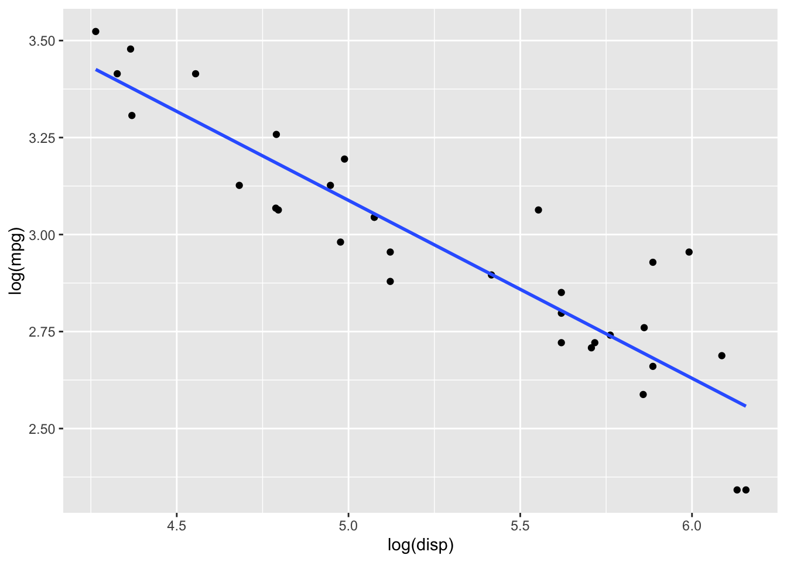

# (PART) Correlation {-}


# Summary Sheet {-}
> How do we test for non-linear association?

## Background {-}
Sometimes the data is strongly correlated, but there is a *non-linear* pattern. Take the following example:


```
##  1  2  3   4   5    6
##  1 16 81 256 625 1296
```

There is a perfect relationship between the data: $y=x^4$. Yet the correlation, calculated from a linear fit, doesn't quite reflect that: $\rho=$ 0.896.

What we're in need of is an improvement of Pearson's correlation. We'd still like it to describe what happens to $Y$ when $X$ increases, but relax the assumption that the relationship needs to be linear. 

## When To Use What {-}


# Parametric OLS 


## Usage

### Assumption


## How It Works

When we fit a line to a slope, we can extract coefficients from our data. Let's take oft-used `mtcars` dataset as an example, regressing `log(mpg)` against `log(disp)`. We can fit a line through this, shown in blue.


```r
data(mtcars)

model = lm(log(mtcars$mpg)~log(mtcars$disp))

mtcars %>%
 ggplot(aes(x = log(disp), y = log(mpg))) +
 geom_point() + geom_smooth(method = "lm", fill = NA)
```



The equation of this line tells us some important information. Given in the form $Y_i = \beta_0 + \beta_1X_i+\varepsilon_i$, we can estimate coefficients from our linear model as $\hat{\beta_0}=$5.381 and $\hat{\beta_1}$-0.459.

**Crucially**: If $\beta_1=0$, $Y$ *doesn't depend on* $X_1$. 

So naturally, we ask the question: "How well does my *estimate* of the slope, or $\hat{\beta_1}$, actually represent $\beta_1$"? In other words, we want to test if $\hat{\beta_1}$ is *significantly different* from $0$.

How? We'll use the t statistic <details><summary>(formula below for those interested) </summary>
<p>

$$
t_{\text {slope}} = \hat{\beta}_{1} / \sqrt{ \frac{\frac{1}{n-2}{\sum_{i=1}^{n}\left(Y_{i}-\hat{Y_{i}}\right)^{2}}} {{\sum_{i=1}^{n}\left(X_{i}-\bar{X}\right)^{2}}} }
$$
</p>
</details>

Assuming our errors, $\varepsilon_i$, are normally distributed about $0$, our $t$ statistic should follow a t-distribution: $t_{\text {slope}}\sim t(n-2)$

## Code

Most regression functions make this super easy to implement.


## Note

**Pearson's Correlation** is a refinement of our basic OLS model, particularly when there is just 1 explanatory variable $X_1$. When we do so, the $R^2$ of our model is actually just square of the correlation of our variables, $cor(X_1,Y)$. We typically use $R^2$ to examine goodness-of-fit, while Pearson's correlation shows how $X_1$ and $Y$ move together.

# Permutation Test for Slope

## Usage

The **permutation test for the slope** helps to determine if there is a significant linear relationship between $X$ and $Y$, when we *can't assume normally distributed error terms*.

### Assumptions
1. We have a random sample of paired measurements $(X_i,Y_i)$.
2.The relationship between $X_i$ and $Y_i$ is linear. 
3. The error terms $\varepsilon_i$ are independent and identically distributed (iid) about zero. However, we no *longer assume a Normal distribution*.

## How it Works

Like many of the previous permutatation tests, we create a p-value that reflects the probability 

Under $H_0$, there is no relation b/w $X$ and $Y$, so any of the observed $Y_i$'s could have come from any of the $X_i$'s.

Given $n$ observations, there are $n!$ ways to reorder $Y_i$'s, because we *fix* $X_i$'s and shuffle the $Y_i$'s 

### p-value

1. Reshuffle the $Y_i$'s to get new pairs $(X_i, Y_i*)$
2. Calculate $\hat{\beta}_1^*$ for the permuted sample
3. Repeat steps 1 and 2 each of $n!$ times to generate all possible permutations
4. p-value is the fraction of $\hat{\beta}_1^*$ as or more extreme than observed:

$$
\begin{array}{l}
p_{\text {lower tail}}=\frac{\# \hat{\beta}_{1}^{*} \leq \hat{\beta}_{1, o b s}}{n !} \\
p_{\text {upper tail}}=\frac{\# \hat{\beta}_{1}^{*} \geq \hat{\beta}_{1, o b s}}{n !} \\
p_{\text {two sided}}=\frac{\# |\hat{\beta}_{1}^{*}| \geq |\hat{\beta}_{1, o b s}|}{n !}
\end{array}
$$


# Spearman's Rank Correlation 

## Usage

Spearman’s rank correlation ($r_s$) calculates the correlation between **ranked** observations.

- $r$ calculates the correlation between the pairs $(X_i,Y_i)$
- $r_s$ calculates the correlation between the pairs $(~R(X_i),R(Y_i)~)$

### Assumptions {-}

- We must have independent paired observations.

We can't measure the association of dependent data (i.e. time series).

### How it Works

By comparing ranks of $X_i$'s to ranks of $Y_i$'s, we can see the extent to which $Y$ increases or decreases with $X$.


We can test strength of correlation with $H_0:\rho_s=0$ and $H_a: \rho_s \geq 0, \rho_s \leq 0, \text{ or } \rho_s \neq 0$

### p-value
1. Reshuffle the $Y_i$’s to get new pairs $(X_i,Y^*_i)$
2. Calculate $r^*_s$ for the permuted sample.
3. Repeat steps 1 and 2, $n!$ times to generate all possible permutations.
4. p-value is the fraction of ${r}_s^*$'s as or more extreme than observed:

<details><summary> Formal Hypothesis Test </summary>
<p>

Hypothesis Test:
$$
\begin{aligned}
H_0 &: \rho_s=0 \\
H_a &: \rho_s \geq 0, \rho_s \leq 0, \text{ or } \rho_s \neq 0 
\end{aligned}
$$

Note: $\rho$ refers to the population measure, while $r$ refers to the observed correlation measure.

P-Value:
$$
\begin{array}{l}
p_{\text {lower tail}}=\frac{\# r_{s}^{*} \leq r_{s, obs}}{n !} \\
p_{\text {upper tail}}=\frac{\# r_{s}^{*} \geq r_{s, obs}}{n !} \\
p_{\text {two sided}}=\frac{\# |r_{s}^{*}| \geq |r_{s, obs}|}{n !}
\end{array}
$$


</p>
</details>


# Kendall's Tau

Kendall’s Tau $\tau$ is a measure of association between X and Y based on *concordance.*

We say that a pair of points $\left(X_{i}, Y_{i}\right)$ and $\left(X_{j}, Y_{j}\right)$ are:
- *Concordant* if $X_{i}<X_{j} \Rightarrow Y_{i}<Y_{j}$, or $\left(X_{i}-X_{j}\right)\left(Y_{i}-Y_{j}\right)>0$
  - If pairs are more likely to be concordant $\implies$ *positive* association
- *Discordant* if $X_{i}<X_{j} \Rightarrow Y_{i}>Y_{j}$, or $\left(X_{i}-X_{j}\right)\left(Y_{i}-Y_{j}\right)<0$
  - If pairs are more likely to be discordant $\implies$ *negative* association

Kendall's Tau definition:
$$
\begin{aligned}
\tau &= 2*P[\left(X_{i}-X_{j}\right)\left(Y_{i}-Y_{j}\right)>0]-1 \\
&= 2*Pr(concordance)-1
\end{aligned}
$$

This scales the probability of concordance so it falls on the $[-1,1]$ scale

### Method

In order to find $P[\left(X_{i}-X_{j}\right)\left(Y_{i}-Y_{j}\right)>0]$:

We define $U_{ij}$ as an indicator if pairs $i,j$ are concordant:
$$
U_{ij} = \begin{cases} 1, & \text{if} \left(X_{i}-X_{j}\right)\left(Y_{i}-Y_{j}\right)>0 \\ 
0, & \text{if} \left(X_{i}-X_{j}\right)\left(Y_{i}-Y_{j}\right)<0 \end{cases}
$$

*Note*: If there are ties, i.e $\left(X_{i}-X_{j}\right)\left(Y_{i}-Y_{j}\right)=0$, then $U_{ij}=\frac{1}{2}$

Then define $V_i$, the number of concordant pairs for a pair $i$, for $j>i$:
$$
V_i = \sum_{j= i+1}^n U_{ij}
$$
The summation $\sum_{i=1}^{n-1} V_i$ is the *total* number of concordant pairs in the entire dataset

To find the fraction of concordant pairs, compute $\frac{\sum_{i=1}^{n-1} V_i}{\binom{n}{2}}$ 

Finally, we plug in to get:
$$
r_{\tau} = 2 * \frac{\sum_{i=1}^{n-1} V_i}{\binom{n}{2}} - 1
$$ 

We can test if there is significant concordance or discorance with $H_0:\tau=0$ and $H_a: \tau \geq 0, \tau \leq 0, \text{ or } \tau \neq 0$


### p-value
1. Reshuffle the $Y_i$’s to get new pairs $(X_i,Y^*_i)$
2. Calculate $r^*_{\tau}$ for the permuted sample.
3. Repeat steps 1 and 2, $n!$ times to generate all possible permutations.
4. p-value is the fraction of ${r}_s^*$'s as or more extreme than observed:

$$
\begin{array}{l}
p_{\text {lower tail}}=\frac{\# r_{\tau}^{*} \leq r_{\tau, obs}}{n !} \\
p_{\text {upper tail}}=\frac{\# r_{\tau}^{*} \geq r_{\tau, obs}}{n !} \\
p_{\text {two sided}}=\frac{\# |r_{\tau}^{*}| \geq |r_{\tau, obs}|}{n !}
\end{array}
$$

## Limitations
- Both look for a monotonic trend only, neither can detect a parabolic trend ($r_s=r_{\tau}=0$)
- We must have independent paired observations (can't use time series b/c dependence)
